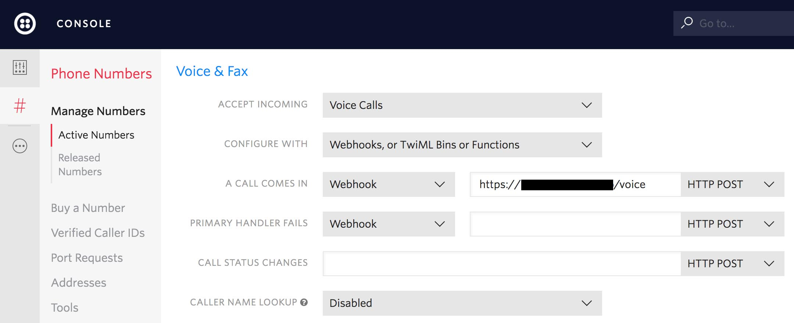

# Phone Call Captcha
Super simple application for filtering robocalls with an audio based captcha.

[![Build][travis-image]][travis-url]

A random 4-digit code is played to the caller, which then must be entered in on their keypad for the call to connect. After the caller has successfully entered the code, they are whitelisted, and are not required to enter a code on subsequent calls.

This app uses the Twilio programmable voice API.


## Setup

```bash
git clone git://github.com/brendan-myers/phone-captcha.git
cd phone-captcha
npm install
```


### Twilio

A Twilio account and number capable of making calls are required.

From the Twilio console, configure the hook for incoming calls to point to the /voice endpoint of this application.




### (Optional) Google Cloud Datastore

By default, the caller whitelist is stored in memory. If you would like whitelist to persist, you will need a Google Cloud Platform account.


### Environment variables

The application expects an environment variable containing the number to forward successful calls to.

```bash 
export OUTBOUND_NUMBER=xxxxxxxxxxxx
```

(Optional) If using Google Cloud Datastore, you will need to set the `WHITELIST_LOCATION=GOOGLE_CLOUD` environment variable, and provide the project ID and the key json file.

```bash
export WHITELIST_LOCATION=GOOGLE_CLOUD
export GOOGLE_CLOUD_PROJECT=xxxxxxxxxxxx
export GOOGLE_CLOUD_KEY=xxxxxxxxxxxx.json
```


## Run

```bash
node .
```
or
```bash
OUTBOUND_NUMBER=xxxxxxxxxxxx WHITELIST_LOCATION=GOOGLE_CLOUD GOOGLE_CLOUD_PROJECT=xxxxxxxxxxxx GOOGLE_CLOUD_KEY=xxxxxxxxxxxx.json node .
```


## TODO
- Tests
- Code cleanup
- Implement saving whitelist to disk

[travis-image]: https://travis-ci.org/brendan-myers/twilio-phone-captcha.svg?branch=master
[travis-url]: https://travis-ci.org/brendan-myers/twilio-phone-captcha